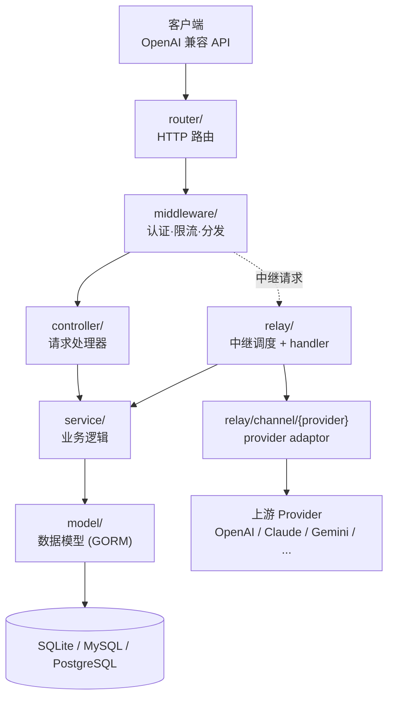
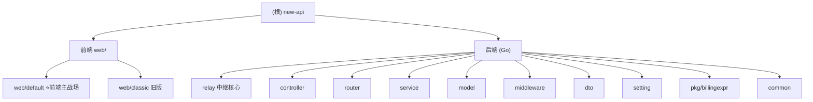

# CLAUDE.md — Project Conventions for new-api

@AGENTS.md

## Claude Code

- Follow the shared project instructions imported from `AGENTS.md`.

## 🧭 项目 AI 上下文导航（二开）

> 更新时间：2026-07-09 23:28:40 ｜ 本节为二次开发（二开）团队自动生成的 AI 上下文导航，仅追加、不改动上方任何原有内容。

### 一句话定位

Go 编写的 **AI API 网关/代理**，聚合 40+ 上游 provider（OpenAI、Claude、Gemini、Azure、AWS Bedrock 等）于统一的 OpenAI 兼容 API 之后，内置用户管理、计费、限流与管理后台。

### 架构总览（分层主链路 + relay 适配器旁路）

### 模块结构图（可点击跳转各模块 CLAUDE.md）

### 模块索引（面包屑导航）

| 模块 | 文档 | 一句话职责 |
| --- | --- | --- |
| **web/default** ⭐ | [web/default/CLAUDE.md](./web/default/CLAUDE.md) | 默认前端（React 19 / Rsbuild / Base UI / Tailwind / Bun），**用户主战场**，详尽指引 |
| web/classic | [web/classic/CLAUDE.md](./web/classic/CLAUDE.md) | 经典前端（React 18 / Vite / Semi Design），旧版维护概览 |
| **relay** ⭐ | [relay/CLAUDE.md](./relay/CLAUDE.md) | AI 中继与 provider adaptor（40+ 上游），**对接其他网关最核心参考** |
| controller | [controller/CLAUDE.md](./controller/CLAUDE.md) | HTTP 请求处理器，对外 API 端点入口 |
| router | [router/CLAUDE.md](./router/CLAUDE.md) | HTTP 路由划分（API/relay/dashboard/web）与认证契约 |
| service | [service/CLAUDE.md](./service/CLAUDE.md) | 业务逻辑层（计费、配额、渠道选择、格式转换等） |
| model | [model/CLAUDE.md](./model/CLAUDE.md) | 数据模型与 DB 访问，GORM 跨三库（SQLite/MySQL/PostgreSQL） |
| middleware | [middleware/CLAUDE.md](./middleware/CLAUDE.md) | 认证、限流、分发（distributor）等中间件 |
| dto | [dto/CLAUDE.md](./dto/CLAUDE.md) | 请求/响应数据结构（指针 + omitempty 保零值规则） |
| setting | [setting/CLAUDE.md](./setting/CLAUDE.md) | 配置管理（ratio/model/operation/system/performance） |
| pkg/billingexpr | [pkg/billingexpr/CLAUDE.md](./pkg/billingexpr/CLAUDE.md) | 表达式计费系统与 quota 安全不变式 |
| common | [common/CLAUDE.md](./common/CLAUDE.md) | 共享工具（强制 `common/json.go` 包装、`quota_math` 等） |
| constant | [constant/CLAUDE.md](./constant/CLAUDE.md) | 全局常量（APIType/ChannelType/EndpointType/ContextKey/TaskPlatform），对接新 provider 的常量入口 |
| types | [types/CLAUDE.md](./types/CLAUDE.md) | 跨层共享类型（RelayFormat 中继格式、PriceData 计费乘数安全入口、NewAPIError 错误体系、FileSource 文件来源） |
| oauth | [oauth/CLAUDE.md](./oauth/CLAUDE.md) | OAuth 第三方登录 provider 抽象与注册表（GitHub/Discord/LinuxDo/OIDC + 通用自定义） |
| relay/channel/task | [relay/channel/task/CLAUDE.md](./relay/channel/task/CLAUDE.md) | 异步任务（视频/音乐）TaskAdaptor 集合（kling/sora/vidu/hailuo/doubao/gemini/vertex/ali/jimeng/suno） |
| **web/default/src/features/channels** ⭐ | [features/channels/CLAUDE.md](./web/default/src/features/channels/CLAUDE.md) | ⭐前端渠道管理 feature（最复杂）：列表/增删改抽屉/测试/取模型/多密钥/标签 |

### ⚠️ 二开维护指南（重点）

本仓库是 **QuantumNous/new-api 的二次开发（二开）分支**，核心风险来自每日自动同步上游。

**1. 每日自动 merge 上游机制**

- 工作流：`.github/workflows/sync-upstream.yml`
- 触发：`cron: '0 20 * * *'`（UTC 20:00 = **北京时间凌晨 4:00**），另支持 `workflow_dispatch` 手动触发。
- 动作链：`git remote add upstream https://github.com/QuantumNous/new-api.git` → `git fetch upstream` → `git merge upstream/main --no-edit` → `git push origin main`。
- **关键风险：没有任何冲突处理逻辑**。一旦你的本地改动与上游改到同一处，`git merge` 步骤会失败、工作流中断、当日**不会 push** —— 需要人工介入解冲突后再同步。**新增独立文件基本安全**（不会冲突）。

**2. 减少冲突的实操建议**

- **前端改动尽量集中在 `web/default/`**（用户主战场），这是与上游冲突面最小的区域之一。
- **避免大面积改动上游后端核心文件**（`relay/`、`controller/`、`service/`、`model/`、`middleware/` 等被上游频繁改动的文件）。
- **优先新增文件，而非改动上游既有文件**；确需改上游文件时，尽量做小而集中的改动，降低 merge 命中概率。
- 需要扩展后端能力时，优先考虑「新增独立文件/新增 adaptor 目录」的方式接入。

**3. 关于本套模块级 CLAUDE.md**

- 本次生成的所有模块级 `CLAUDE.md` 均为**新增文件**，落在上游目录内。绝大多数情况下安全（上游没有同名文件）。
- 极少数情况下，若上游未来在同一目录添加同名 `CLAUDE.md`，同步时会冲突；届时**以本地为准**，或删除后用初始化架构师流程重新生成即可。

**4. 前端主战场入口**

- 一切前端修改从这里开始：**[web/default/CLAUDE.md](./web/default/CLAUDE.md)**（含技术栈、目录结构、i18n、状态管理、开发命令、如何新增页面/组件）。

**5. 后端对接参考入口（对接其他网关时复用）**

- 中继与适配器机制（最可复用）：**[relay/CLAUDE.md](./relay/CLAUDE.md)**
- 对外 API 契约与认证：**[router/CLAUDE.md](./router/CLAUDE.md)**、**[controller/CLAUDE.md](./controller/CLAUDE.md)**
- 数据模型与渠道配置：**[model/CLAUDE.md](./model/CLAUDE.md)**
- 计费与配额安全：**[pkg/billingexpr/CLAUDE.md](./pkg/billingexpr/CLAUDE.md)**、**[service/CLAUDE.md](./service/CLAUDE.md)**

> 权威规范以根级 `AGENTS.md`（后端/计费/数据库规则）与 `web/default/AGENTS.md`（前端规范）为准，本导航与模块文档仅作快速索引，不替代它们。

### 变更记录 (Changelog)

- **2026-07-09 23:28:40**：初始化二开 AI 上下文导航，新增本节与 12 份模块级 `CLAUDE.md`（前端 2 份详尽/概览、后端 10 份概览）。
- **2026-07-09 23:51:43**：第二批补扫，新增 constant / types / oauth / relay·channel·task / web·default·features·channels 共 5 份模块文档。
